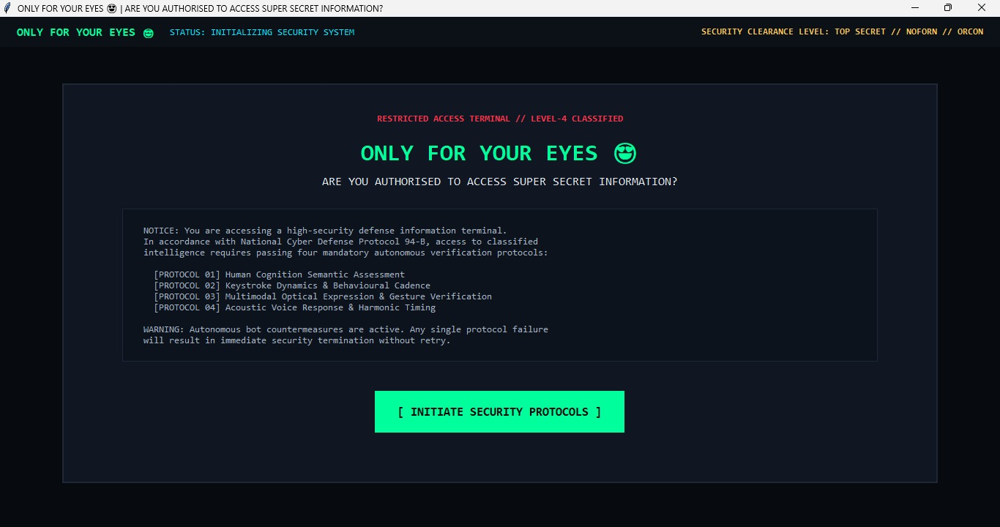
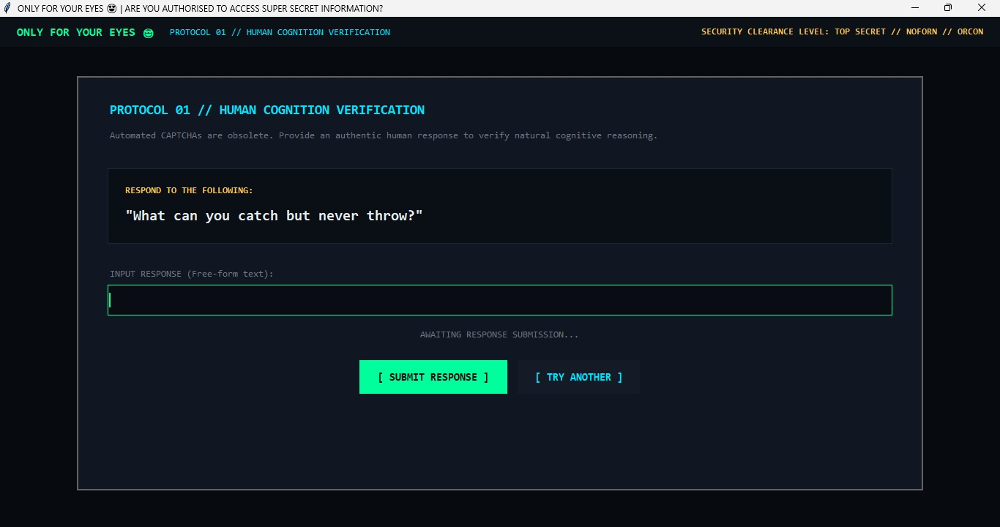
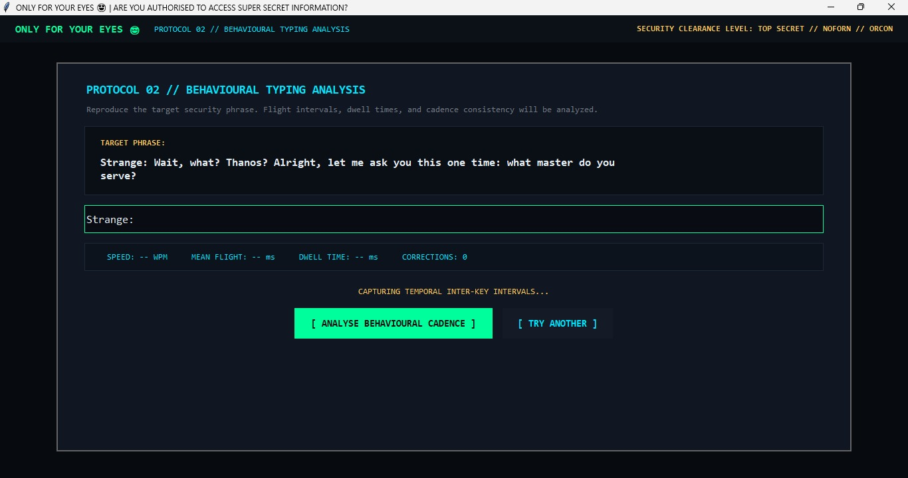
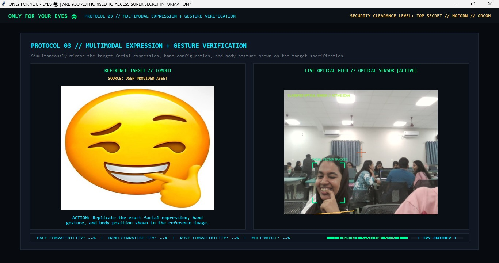
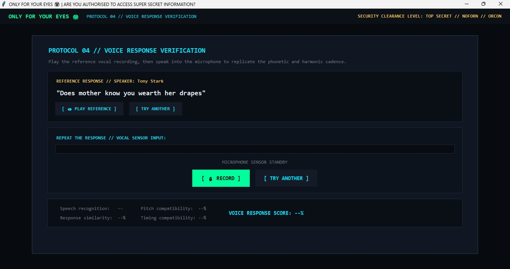
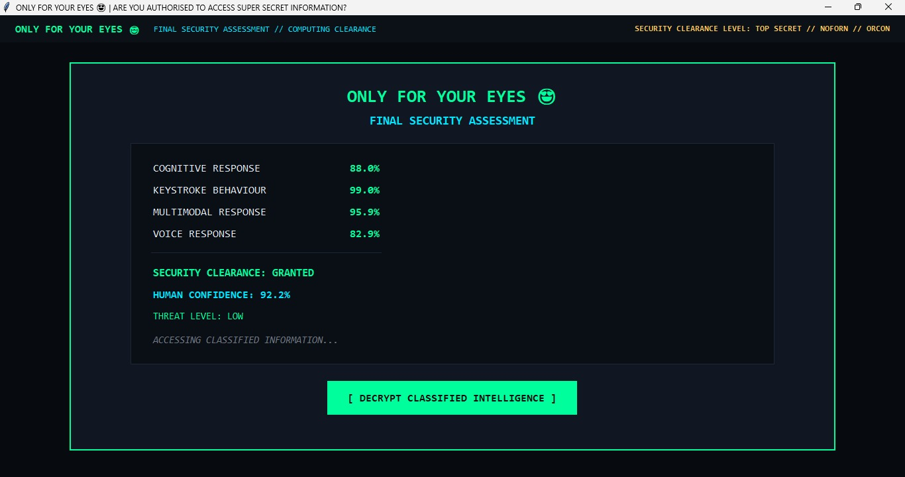
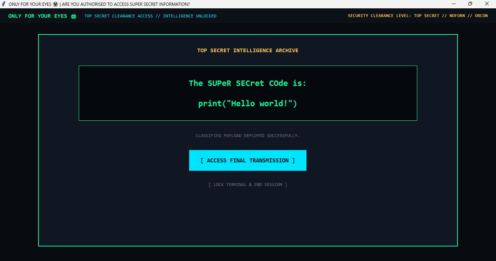
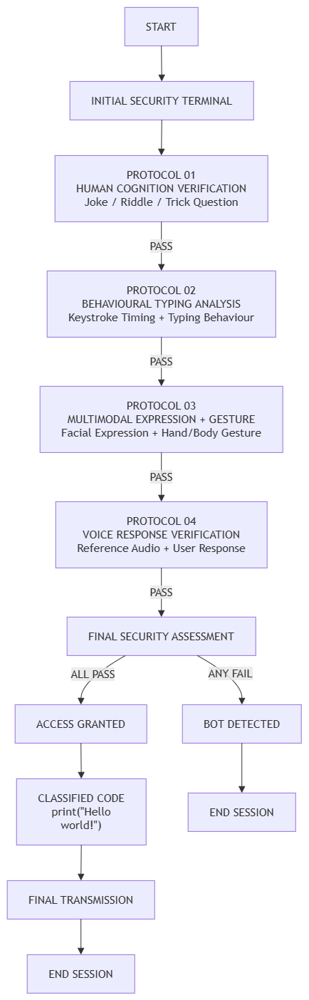

# ONLY FOR YOUR EYES 😍

## Basic Details
### Team Name: Idk.exe

### Team Members
- Member 1: Ishaal Fathima - Muthoot Institute of Technology and Science
- Member 2: Navami Sreeja Jimmy - Muthoot Institute of Technology and Science

### Project Description
"ONLY FOR YOUR EYES 😍" is an absurdly over-secured authentication system designed to protect an extremely valuable piece of information: absolutely nothing. Users must survive multiple security protocols including password authentication, CAPTCHA verification, keystroke analysis, mouse behaviour analysis, and facial expression verification before gaining access to the classified secret.

### The Problem (that doesn't exist)
Some information is apparently so important that it needs multiple layers of authentication, behavioural analysis, and human verification.

We decided to solve the much more important problem of not having enough security for completely useless information.

### The Solution (that nobody asked for)
"ONLY FOR YOUR EYES 😍" combines four increasingly unnecessary security protocols into one highly classified authentication system.

Users must:

Solve a joke, riddle, or trick question through free-text input
Demonstrate a sufficiently human typing pattern
Reproduce a randomly assigned facial expression or hand gesture
Listen to a voice clip and reproduce the corresponding response

Users can also choose TRY ANOTHER during the individual protocols to receive a different challenge without restarting the session.

Every protocol must independently pass. Failing even one protocol results in immediate access termination.

## Technical Details
### Technologies/Components Used
For Software:
- Languages used: Python
- Frameworks used: tkinter
- Libraries used: Opencv, Mediapipe, pillow
- Tools used: Git, Github, VS code

For Hardware:
- Laptop/PC
- Built-in or USB webcam
- Microphone

### Implementation
For Software:

Human Cognition Verification: Free-response jokes, riddles, and trick questions are evaluated against expected answers.
Behavioural Typing Analysis: Typing speed, timing, and keystroke behaviour are analysed while the user reproduces a short dialogue.
Multimodal Expression + Gesture Verification: OpenCV and MediaPipe are used to analyse facial landmarks and hand/body gestures through the webcam.
Voice Response Verification: User responses are evaluated based on speech content, timing, pitch/prosody, and audio characteristics against the selected voice challenge.
Final Security Assessment: All protocols are evaluated independently. A failure in any single protocol results in a BOT DETECTED screen and termination of the session.
# Installation
git clone <repository-url>
cd idk.exe
py -V:3.12 -m pip install -r requirements.txt

# Run
py -V:3.12 main.py

### Project Documentation
For Software:

# Screenshots 

*Initial security terminal displaying the classified access notice and the four mandatory security verification protocols.*

*Protocol 01: Human Cognition Verification using a free-form joke, riddle, or trick-question response.*

*Protocol 02: Behavioural Typing Analysis capturing typing speed, inter-key timing, dwell time, and typing corrections.

*Protocol 03: Multimodal Expression and Gesture Verification comparing the user's live webcam input with the selected reference target.*

*Protocol 04: Voice Response Verification using a reference audio clip and microphone input to analyse the user's response.*

*Final Security Assessment displaying the individual protocol results and overall human confidence before classified access is granted.*

*Classified message revealed after successfully passing all security protocols, followed by the final transmission.*

# Diagrams

*The system begins at the initial security terminal and guides the user through four verification protocols: human cognition, behavioural typing, multimodal expression and gesture, and voice response verification. Each protocol must be passed independently, with any failure terminating access, while successfully passing all four leads to the final security assessment, classified message, and final transmission.*

### Project Demo
# Video
[🎥 Watch the Project Demo](Project-demo.mp4)
*The demo showcases the complete authentication flow of "ONLY FOR YOUR EYES 😍", including all four security protocols: Human Cognition Verification, Behavioural Typing Analysis, Multimodal Expression + Gesture Verification, and Voice Response Verification. The system evaluates the user's responses at each stage and displays a Final Security Assessment before granting access. After successfully passing all protocols, the classified secret `print("Hello world!")` is revealed, followed by the final transmission.*

## Team Contributions

- Ishaal Fathima:
  - Found and prepared the dialogue/text materials used for the Behavioural Typing Analysis protocol
  - Selected the custom emoji/expression references used for the Multimodal Expression + Gesture Verification protocol
  - Generated the initial project implementation in Antigravity using the project prompt
  - Worked on the initial integration and development of the application

- Navami Sreeja Jimmy:
  - Designed and prepared the overall project prompt and system requirements
  - Researched and selected the jokes, riddles, and trick questions used for the Human Cognition Verification protocol
  - Collected and prepared the voice recordings used for the Voice Response Verification protocol
  - Refined the project implementation and rectified issues in the initial generated version
  - Worked on integrating and improving the individual verification protocols and their functionality

---
Made with ❤️ at TinkerHub Useless Projects 

